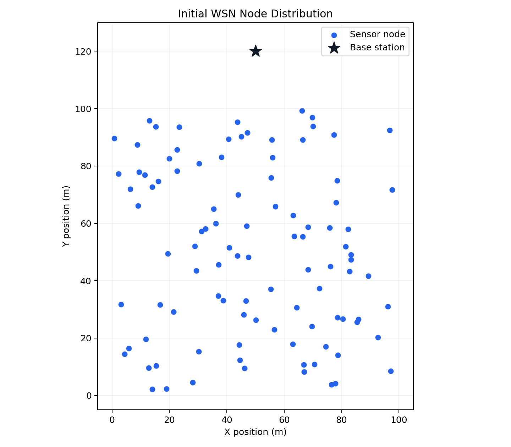
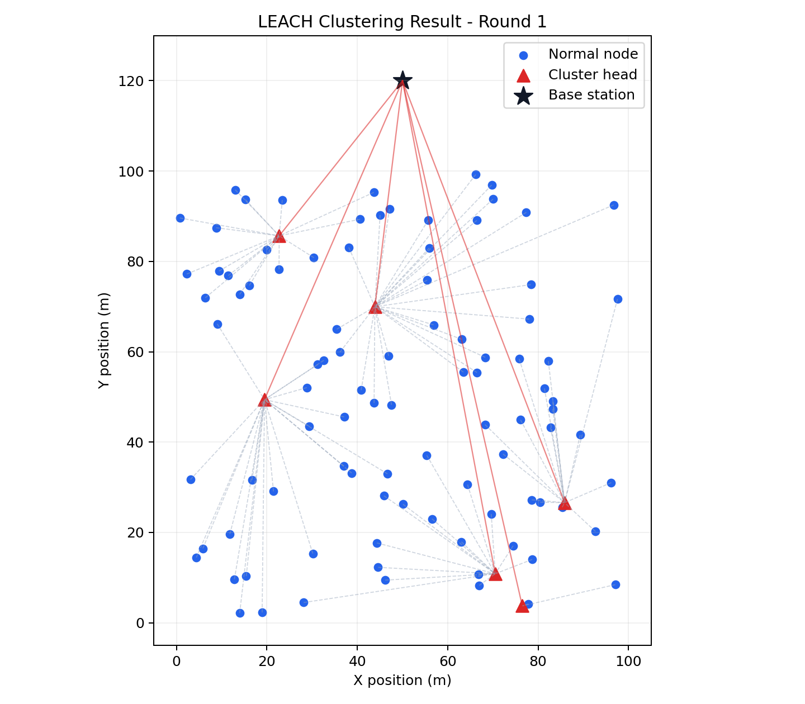
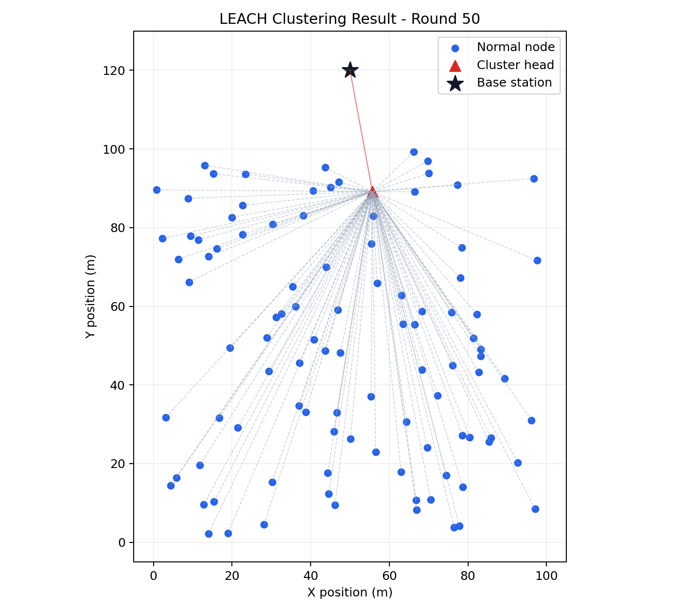
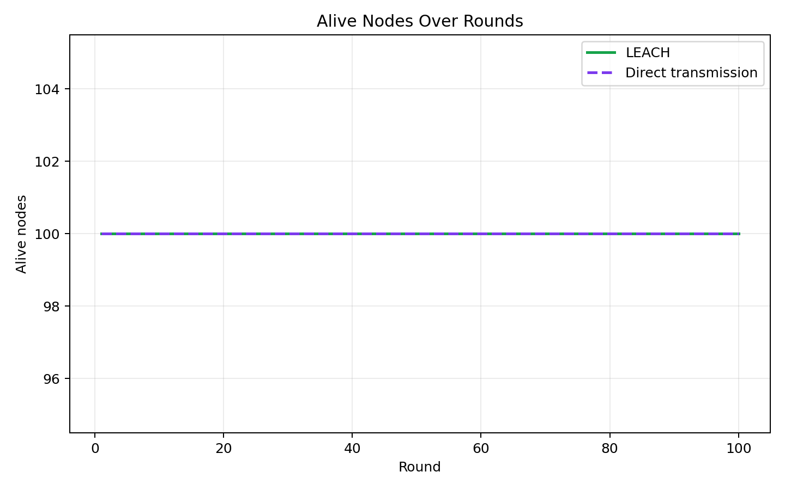
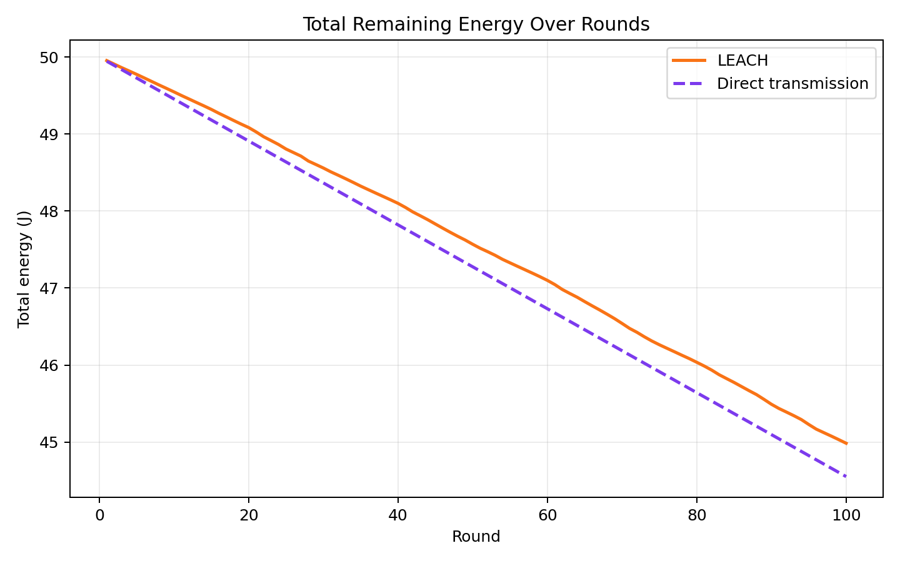
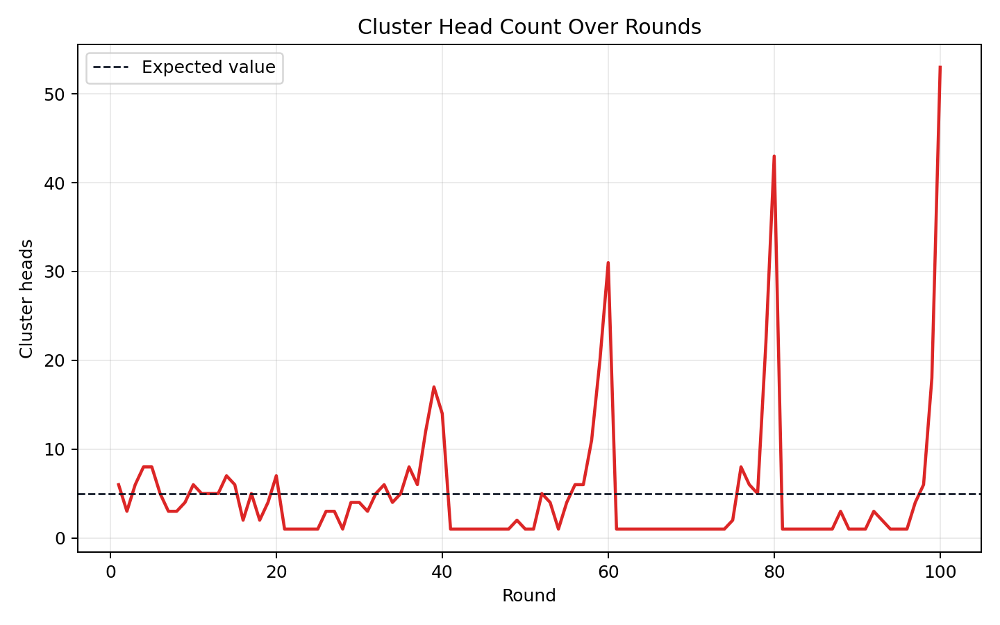
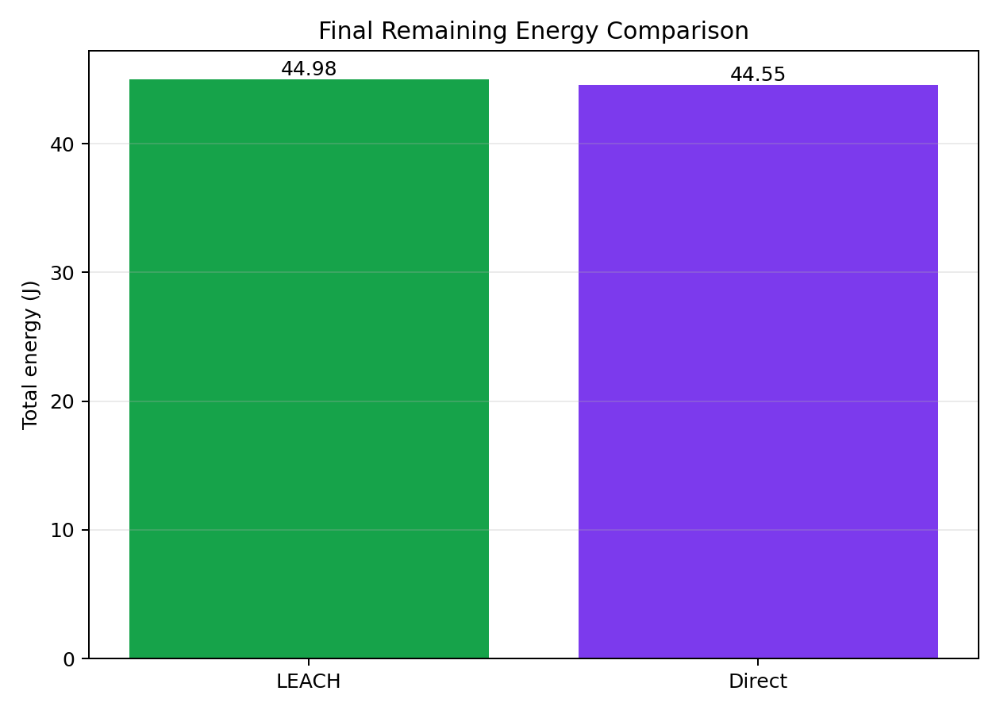

# WSN 节点分簇聚合模拟实验报告

## 一、实验目的

1. 了解无线传感器网络 WSN 的基本组成与通信特点。
2. 理解 LEACH 分簇聚合算法的簇头轮换、节点入簇和数据聚合思想。
3. 使用 Python 3.13 编写多轮 WSN 节点分簇聚合仿真程序。
4. 通过图表分析节点存活数量、网络剩余能量和簇头数量变化，并比较 LEACH 与普通直接传输的能耗差异。

## 二、实验环境

| 环境项目 | 内容 |
| --- | --- |
| 编程语言 | Python 3.13 |
| 第三方库 | numpy, matplotlib |
| 程序文件 | `leach_simulation.py` |
| 输出目录 | `outputs` |

## 三、实验原理

WSN 是由大量低功耗传感器节点组成的无线网络，节点通常能量有限，直接向远端基站发送数据会快速消耗电量。LEACH 协议通过随机轮换簇头，将网络划分为多个簇：普通节点把数据发送给最近簇头，簇头接收并聚合数据后再发送到基站。这样可以减少长距离发送数据包的数量，并避免固定簇头长期承担高能耗任务。

LEACH 簇头阈值函数为：

```text
T(n) = p / (1 - p * (r mod (1 / p))), n 属于最近 1/p 轮未当过簇头的集合 G
T(n) = 0,                             n 不属于 G
```

其中 `p` 为期望簇头比例，`r` 为当前轮次。程序还设置了兜底机制：若某轮随机选举没有产生簇头，则从存活节点中随机选择一个簇头，保证本轮分簇能够继续进行。

能量模型采用一阶无线电模型。短距离使用自由空间模型，长距离使用多径衰落模型，距离阈值为 `d0 = sqrt(epsilon_fs / epsilon_mp)`：

```text
发送 k bit 到距离 d：
  d < d0  时，E_tx = k * E_elec + k * epsilon_fs * d^2
  d >= d0 时，E_tx = k * E_elec + k * epsilon_mp * d^4
接收 k bit：E_rx = k * E_elec
数据聚合：  E_DA = k * E_da
```

## 四、程序设计

| 模块 | 说明 |
| --- | --- |
| 参数配置 | `SimulationConfig` 保存区域、节点数量、轮数、能量模型和基站位置 |
| 节点模型 | `Node` 保存编号、坐标、剩余能量、存活状态、簇头状态和所属簇 |
| LEACH 仿真 | 每轮完成簇头选举、最近簇头入簇、簇内传输、簇头聚合和基站传输 |
| 直接传输仿真 | 使用相同初始节点，每轮所有存活节点直接向基站发送数据 |
| 统计模块 | 记录存活节点数、死亡节点数、总能量、簇头数、平均簇规模和发送包数量 |
| 可视化模块 | 输出节点分布图、分簇快照、存活曲线、能量曲线、簇头数量曲线和能量对比图 |

## 五、实验参数

| 参数 | 取值 |
| --- | --- |
| 仿真区域 | 100 m x 100 m |
| 节点数量 | 100 |
| 仿真轮数 | 100 |
| 随机种子 | 42 |
| 初始能量 | 0.5 J |
| 期望簇头比例 | 0.05 |
| 理论平均簇头数 | 5.00 |
| 数据包大小 | 4000 bit |
| 基站位置 | (50.0, 120.0) |
| E_elec | 5.00e-08 J/bit |
| epsilon_fs | 1.00e-11 J/bit/m^2 |
| epsilon_mp | 1.30e-15 J/bit/m^4 |
| 距离阈值 d0 | 87.71 m |
| E_da | 5.00e-09 J/bit |

## 六、实验结果

程序运行后生成以下主要结果文件：

| 文件 | 说明 |
| --- | --- |
| `initial_distribution.png` | 初始节点随机分布图 |
| `cluster_round_1.png` | 第 1 轮 LEACH 分簇结果 |
| `cluster_round_10.png` | 第 10 轮 LEACH 分簇结果 |
| `cluster_round_50.png` | 中间轮次 LEACH 分簇结果 |
| `cluster_round_100.png` | 最后一轮 LEACH 分簇结果 |
| `alive_nodes_curve.png` | LEACH 与直接传输的存活节点数量对比 |
| `total_energy_curve.png` | LEACH 与直接传输的网络总剩余能量对比 |
| `cluster_head_count_curve.png` | LEACH 每轮簇头数量变化 |
| `energy_comparison.png` | 最终剩余能量柱状对比 |
| `simulation_summary.csv` | 两种协议的逐轮统计数据 |

主要结果图如下：















本次 LEACH 仿真实际完成 100 轮，最终存活节点数为 100，最终网络总剩余能量为 44.984098 J。直接传输最终存活节点数为 100，最终网络总剩余能量为 44.551199 J。LEACH 比直接传输多保留 0.432899 J 能量，约占初始总能量的 0.87%。

| 指标 | LEACH | 直接传输 |
| --- | --- | --- |
| 最终存活节点数 | 100 | 100 |
| 最终死亡节点数 | 0 | 0 |
| 最终总剩余能量 | 44.984098 J | 44.551199 J |
| 第一个节点死亡 | 未发生 | 未发生 |
| 半数节点死亡 | 未发生 | 未发生 |
| 全部节点死亡 | 未发生 | 未发生 |

LEACH 每轮平均簇头数量为 5.02，与理论期望值 5.00 接近。由于簇头选举包含随机性，不同轮次簇头数量会围绕期望值上下波动。

## 七、结果分析

从分簇图可以看到，普通节点会连接到距离最近的簇头，簇头再与基站通信，形成“普通节点到簇头、簇头到基站”的两级传输结构。不同轮次的红色簇头位置不同，说明 LEACH 通过轮换机制分摊了高能耗任务。

从能量曲线可以看到，网络总能量随通信轮次增加持续下降。直接传输中每个节点都需要远距离发送到基站，整体能量下降更快；LEACH 让多数节点只进行短距离簇内发送，只有少量簇头向基站发送聚合数据，因此在相同轮数后保留了更多能量。

从簇头数量曲线可以看到，簇头数并不是固定值，而是在随机阈值控制下接近期望簇头比例。若某轮没有自然产生簇头，程序会随机补选一个存活节点，避免网络无法分簇。

## 八、实验总结

本实验完成了 WSN 节点随机部署、LEACH 簇头选举、最近簇头入簇、数据聚合传输、能量消耗统计和结果可视化。相比简单静态散点图，本程序实现了多轮动态仿真，并增加了与直接传输方式的对比，更直观地展示了 LEACH 协议在降低长距离通信开销、均衡节点能耗方面的作用。
